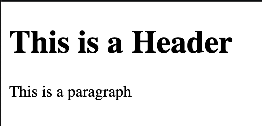

# 1. HTML, CSS, and JavaScript

* Most websites operate using a combination of HTML, CSS, and JavaScript.
* HTML (which stands for HyperText Markup Language) is what makes the basic building blocks for a webpage, for example we can make a button, a paragraph, a header, etc. in HTML. These will look uniform and basic, unless we style them in some way. 
* This is where CSS comes in! (CSS stands for Cascading Style Sheets) CSS can be used to specify things like color, size, position, animation, and many more features! Basically, CSS is what makes webpages look good! 
* You can do a lot with just HTML and CSS, but if you want to make your webpage truly interactive, you need JavaScript! In JavaScript we can program actions, such as making something happen when a button is clicked. Many of the features that we know and love about websites are made possible through JavaScript!
* Out of these three languages, JavaScript is the most complicated. This course will mostly focus on it. Before we get started with the basics of JavaScript, we will take a quick look at HTML and CSS, to get an understanding later on, as we will be using them in conjunction with JavaScript, especially later in the course. 

--- 

# 2. Introduction to HTML 

* HTML uses tags to create elements. Elements are different types of basic things that you can put on a webpage, for example a button, paragraph, a header, etc. There are not that many differnt types of elements. Here is a list: https://www.w3schools.com/tags/default.asp
* When you make elements in HTML, they look very simple. They can be styled to look good in CSS. 
* HTML tags are created like this:

```
<h1>This is a Header</h1> <p>This is a paragraph</p> 
```

<!--  -->


* If we want to see what these tags will look like on our webpage, we can look at this example in CodePen, which is the platform we will be using to do our assignments and execute our code: 

CODEPEN EXAMPLE HERE

* These are two different elements, a header, and a paragraph. 
* The first tag is the opening tag. We use arrows around whatever type of element we are making, so in this case, h1 for header, and p for paragraph. 
* The closing tag has a forward slash before the element type. It is important to close the tags of most elements, otherwise it will affect formatting. 
* Whatever text we want displayed in our header goes between the opening and closing tags. 

--- 

## Ids and Classes

* Another important feature of HTML tags is that we can give them ids and classes. We will not be doing much of this now, but it will be very important later on. 

### Ids:

* An id is given to an individual element. Only that element can use that specific id name. 

### Classes: 

* A class can be given to a group of different elements, so they can be styled the same way, for example if we had five different headers, and we wanted to make them all blue, we could do that by giving them the same class. 

* Elements can have both a class and an id. 

* We add a class or an id like this: 

```
<h2 id="secondHeader"> This is a slightly smaller header </h2>
<h3 class="headerClass"> This is an even smaller header </h3>
```

* We put the id and/or class in the opening tag. We add an equals sign, and then give the id or class a name, in quotes, with no spaces. It is good to give it a name that makes sense to the element or its use.

--- 

## Buttons

* Button tags make a basic button in HTML, which can be styled to look different in CSS. If we wanted our button to actually do anything, we would have to program a function in JavaScript, which we will learn how to do later on in the class!
* A button element simply has the tag button, and can contain any text that you want between the opening and closing tags, like this:
```
<button> Click me! </button> // Need a codepen example for this!
```
* If we click the button, nothing will happen, because it must be programmed using JavaScript!

--- 

## Images

* If we want to create an image element, we would use the  tag, which unusually does NOT need a closing tag. 

* We need to include a link to an image. Use src, with an equals sign, and then a link, in quotes. 

* One good way to get an image is to look for a website that provides free images (images that aren't copyrighted!) It's important to check whether images you want to use are copyrighted or not!

* This is a good website for free images: https://unsplash.com/

* Once you select an image you like, you can click on the image, and then right-click on it, and select "Copy Image Address." You can then paste it into your img tag, like this: 

```
 // needs to be a codepen example!
```

HTML exercises here: 

--- 

# 3. Introduction to CSS

* CSS is where we make web pages look GOOD! We can change colors, sizes, positions, fonts, and animate things, just as some examples. 

* In CSS, we select the HTML element that we want to style. We can either select it by its element type, class, or id. 

* If we select something by element type, our styling will affect all elements of that type. If we select something by class, all elements of the class will be affected. If we select something by id, only the single element with that id will be affected. 

* Lets try selecting our h1. Since we only have one h1 element, only that element will be affected. 

First, we type out the element, then we add some curly brackets. Inside the curly brackets, we can add different properties, for example color (which changes text color).

We add a colon, and then our property. We can write colors out, but if we want something more specific, we can use other methods which we will learn about later on. 


h1 {
  color: blue
}

CODEPEN 
--- 

## Changing size and font size

One of the most basic things that we need to be able to control is size. If I want to change the size of my image, I can do so in CSS. I can also change the font size. 

A simple unit for specifying size is px, which stands for pixels. A pixel is a tiny area of illumination on a screen, so pixels refer to a certain amount of space. 

If I wanted to make my header larger, for example, I could enlarge the font size using px: 

h1 {
font-size: 60px
}

Once I uncomment this code, you will see the first header get larger. 

If I want to increase the size of something without text, I can size it using the height and width properties. 

Since an image already has a set size, if I change both height and width, I could mess up the proportions. If I just adjust height, width will also be adjusted proportionally, and vice versa, see below. 


img {
  width: 200px
}

It is good to try out different pixel sizes to see what works for each element!


After you are done with this section, continue to "4. Important Javascript Charectaristics" in the Javascript sections.


/*
///////////Exercises/////////////
1.3 In the same pen as your header, in the CSS section, change the color of your text by typing 
h1 with curly brackets, and then the color property, followed by a colon. Set it to a color of your choice!

1.4 Change the size of your button, and the color of the text. 


