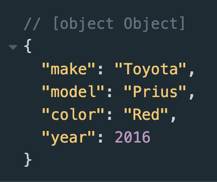

# JavaScript Data Types 
    
* You may have noticed in the first two sections that we declare new variables in the same way no matter what we set them equal to, by using the let keyword and giving the variable a name.
* JavaScript has dynamic variables. This is what allows us to declare all variables in the same way, and what allows us to reset a variable that may have stored a number before, to storing a string of text.
* Without realizing, though, you have been following syntax conventions for different data types.
* When we set a new variable equal to a number, we simply set it equal to that number. But when we set a new variable equal to text, we set it equal to the text within quotation marks. 
* It is important to become familiar with the different data types, and when and how to use them.
---
## 1. Numbers
* Other programming languages typically specify the use between variables that store integers, which are whole numbers, and variables that store doubles, which are numbers with fractions or decimals.
* JavaScript has dynamic variables, however, so there is no need to specify whether a variable is storing an integer or decimal/double. 
* To create a variable that stores a numeric value, we simply declare a new variable to that value. Examples:
```
let myNumber = 45678930;
let shoppingBill = 45.89;
let myAge = 20;
let numberOfPetsIOwn = 4;
```
---
## 2. Strings
* Strings are variables that store text. Variables that store strings are set equal to the string in quotation marks, whether it be a sentence, paragraph, or a single word. Examples:
```
let myString = "This is my string.";

let myParagraph = "This is my paragraph. It isn't about anything yet, it just exists to show you some examples of a string. This paragraph could be as long or as short as I want it to be. But, I am out of sentences, so I'll cut it short.";

let name = "Bob Ross";
let firstName = "Leslie";
let lastName = "Knope";
```
---
## 3. Booleans
* Booleans are variables that store a true or false value. The variables are identified with a name, and set to either true or false. 
* Booleans are important and useful variables, as they are used in conditional and logical statements, which we will visit later. Examples:
```
let myBoolean = false;
let pizzaIsGross = false;
let pizzaIsYum = true;
```
---
## 4. Arrays
* Arrays are variables that store a collection of data. They are used to store multiple values within one variable. 
* The following syntax will declare an empty array with an unspecified size. Remember that the value of unassigned variables, including unassigned arrays, is undefined.
```
let myEmptyArray = [];
```
* Arrays are declared by assigning the variable to data enclosed in brackets and separated by commas. 
* Arrays can store any data type and combinations of different data types. Ex:
```
let myArray = ["my", "JavaScript", "Array"];
let testScores = ["Jane", 80, "Matt", 76, "Kate", 90, "Rachel", 98, "Bartholomew", 85];
```
---
* If necessary, the declaration of an array can span across multiple lines, such as:
```
let sameTestScores = [
"Jane", 80, 
"Matt", 76, 
"Kate", 90, 
"Rachel", 98, 
"Bartholomew", 85
];

    // or

let animals = [
"dogs",
"cats",
"chinchillas"
];
```
---
* An element is a single value or input in the array. For example, in the second array from the example above, “dogs”, “cats”, and “chinchillas” are all single elements in the array. 
* Each element has an index within the array. An element's index tells us where it is located in the collection of data. 
* Array indexes begin at position 0. The first element in an array, then, has an index of 0. The second element is at index 1, the third is at index 2, and so on.
* To access data stored in arrays, we have to specify the index of the element we want to obtain. 
---
Example: I want to obtain the second element within the array named animals. The second element in this array is the string "cats". 
The first element is at index 0, so we know the second element is at index 1. We would access the element at index 1 like so:
```
let animals = ["dogs","cats","chinchillas"];
animals[1]; 
```
Elements can be accessed by specifying their index within an array and can be assigned to a new value. Ex:
```
animals[1] = "polar bears";
```
* The array named animals would still contain 3 elements, but instead of dogs, cats, and chinchillas, the array now contains dogs, polar bears, and chinchillas.
---
<p class="codepen" data-height="300" data-theme-id="light" data-slug-hash="your-pen-id" data-user="your-username" style="height: 300px; box-sizing: border-box; display: flex; align-items: center; justify-content: center; border: 1px solid #ccc; margin: 1em 0; padding: 1em;">
  <span>See the Pen <a href="https://codepen.io/lsuddem/pen/wBwgdqK
  ">
1.3 Examples</a> <a href="https://codepen.io/lsuddem/pen/wBwgdqK
  "></a>
  on <a href="https://codepen.io">CodePen</a>.</span>
</p>
<script async src="https://cpwebassets.codepen.io/assets/embed/ei.js"></script>
--- 

* Side Note: Sometimes the content of an array needs to be added in later, and we want to create an empty array. 
* If we know what size our array is going to be, we can declare an empty array of a fixed size like so:
```
let finalExamScores = new Array(30); 
```
* The variable finalExamScores is now assigned to a new array with 30 empty (undefined) elements. 
---
## 5. Objects
* An object is a collection of properties, and a property is an association between a name (or key) and a value.
* Objects are essentially used to store multiple values within one container.
* These values are referred to as properties of the object
* To understand properties, think of your dream car. Describe the car to yourself. You'll probably mention the color, make, model, etc. These are properties of the car.
* Cars are not the only things with properties, however. For example, describe yourself or your friend. You'll probably mention name, hair color, eye color, favorite show, favorite animal, etc.
* These are all properties of yourself or your friend! 
---
* Objects allow us to create a variable in our program with which we can store all of these properties. 
* So, we can make an object that represents ourself, our friend, our dream car, or anything else, and store the properties in it.
* The value of a property can be any data type, meaning the 'year' property of a car can store a numeric value, while the 'model' property stores a string value
* We assign properties to objects in name:value pairs, either during the construction of an object, or after an object has been created
---
* We can either create an object and add properties to it at the same time, or we can create an empty object and add properties to it later. We can always add more properties to an object after we’ve created it. 
To create an object and add properties to it, we use this syntax: 
```
let myObject = {
	property : value,
	property1 : value1,
};
```
* If we wanted to apply our car example this syntax, we could do it like this:
```
let newCar = {
make:"Honda", 
model:"Civic", 
color:"Gray"
};
```
* We can also create an object on a single like, like this: 
```
let newCar1 = {make:"Toyota", model:"Prius", color:"Red"};
```
---
* If we want to access a property from our object, we need to use the name of our object, and then access the specific property using dot notation or bracket notation. 
1. Dot Notation. Ex: objectName.propertyName  
* Dot Notation uses a dot/period between the object name and property name to access or declare that property
2. Bracket Notation. Ex:objectName["propertyName"]
* Bracket Notation uses a pair of brackets after the object name, with the property name placed inside of the brackets in quotation marks

* Dot Notation is more often used because it is easier to read and is more efficient, as we have to type less characters than we would using bracket notation; however the two are interchangeable
---
We can use this to print properties or display our properties on the webpage: 
```
console.log(newCar.make)
document.write(newCar1[make])
```
* We can use dot notation or bracket notation to add a new property to our object, like this:
```
newCar1.year = 2016;
```
* Now, if we print our entire object to the console, we will see that the new property value pair has been added. 
```
console.log(newCar1)
```
Console View: 

---

* We can also create an empty object and then add properties to it, like this:
```
let myNewObject = new Object();
myNewObject.firstProperty = “first property”;
myNewObject.secondProperty = 23;
```
* The "new Object()" value is called a Constructor. 
* A constructor is code that creates, or *constructs*, a new instance of something that has already been programmed. 
* In this case, the constructor creates a new instance of an object. Objects have already been programmed into the JavaScript library, so the constructor uses the code as a blueprint to create our new object.  
* We are able to program our own constructors, and use other constructors built into the JavaScript library, but we will cover these more in depth in a later segment.

# Exercise 1.3

<p class="codepen" data-height="300" data-theme-id="light" data-slug-hash="your-pen-id" data-user="your-username" style="height: 300px; box-sizing: border-box; display: flex; align-items: center; justify-content: center; border: 1px solid #ccc; margin: 1em 0; padding: 1em;">
  <span>See the Pen <a href="https://codepen.io/lsuddem/pen/EaYZXVr
  ">
Exercise 1.2</a> <a href="https://codepen.io/lsuddem/pen/EaYZXVr
  "></a>
  on <a href="https://codepen.io">CodePen</a>.</span>
</p>
<script async src="https://cpwebassets.codepen.io/assets/embed/ei.js"></script>