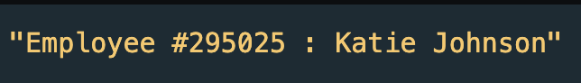

### Writing Methods 

As mentioned earlier, objects can have methods that we can invoke to perform some kind of function or action on the object

Methods are stored as an object property, but are programmed by defining a new function

To look at a few examples, we will use an object representing an employee of an imaginary company named Katie Johnson.

This object stores the information for employee Katie Johnson, with properties for her name, ID, phone number, address, hourly wage, and number of hours worked this week.

The last property of the employee object will be the method called "printEmployeeInfo"

The printEmployeeInfo method declares a new function that returns the employee ID and full name in a formatted order

You'll notice that the method uses a new keyword we haven't worked with yet, "this"

When used in an object method, the 'this' keyword refers to the object in context.

For example within our  printEmployeeInfo method, this.firstName is equivalent to saying employee.firstName

```js
let employee = {
  firstName: "Katie",
  lastName: "Johnson",
  employeeID: 295025,
  phone: 4560001234,
  address: "42 Wallaby Way",
  wage: 13.5,
  hoursWorked: 25,
  printEmployeeInfo: function() {
    return "Employee #" + this.employeeID + " : " + this.firstName + " " + this.lastName;
  }
};

console.log(employee.printEmployeeInfo());
```
Console view:


In codepen, we will add a method to  to the employee object that calculates their weekly pay
This method will be called "paycheck" and will return the product of the employee object's wage property and the employee object's hoursWorked property. 

Codepen example: 

<p class="codepen" data-height="300" data-default-tab="result" data-slug-hash="xbKgeYg" data-pen-title="Untitled" data-user="lsuddem" style="height: 300px; box-sizing: border-box; display: flex; align-items: center; justify-content: center; border: 2px solid; margin: 1em 0; padding: 1em;">
  <span>See the Pen <a href="https://codepen.io/lsuddem/pen/xbKgeYg">
  Untitled</a> by LSU DDEM (<a href="https://codepen.io/lsuddem">@lsuddem</a>)
  on <a href="https://codepen.io">CodePen</a>.</span>
</p>
<script async src="https://cpwebassets.codepen.io/assets/embed/ei.js"></script>

#### Exercise 4.7

<p class="codepen" data-height="300" data-default-tab="result" data-slug-hash="ZYzLZob" data-pen-title="Exercise 4.7" data-user="lsuddem" style="height: 300px; box-sizing: border-box; display: flex; align-items: center; justify-content: center; border: 2px solid; margin: 1em 0; padding: 1em;">
  <span>See the Pen <a href="https://codepen.io/lsuddem/pen/ZYzLZob">
  Exercise 4.7</a> by LSU DDEM (<a href="https://codepen.io/lsuddem">@lsuddem</a>)
  on <a href="https://codepen.io">CodePen</a>.</span>
</p>
<script async src="https://cpwebassets.codepen.io/assets/embed/ei.js"></script>