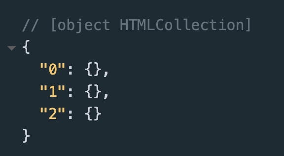

### Accessing HTML and CSS in Javascript 
---

#### document.getElementById()

* document.getElementById() is used to access an element by its id name. 

* For this method, we DO NOT use the hash sign (#), because JavaScript already knows that it is looking for an id. So if we have an element, like this: 

---

```html
<h1 id="header1">This is my Header</h1>
```
We could access it in javascript like this: 
```js
let myHeader = document.getElementById("header1");
myHeader.innerHTML = "New Text" 
```

* In this example, the text in the header will change to "New Text".

---

* Practice in Codepen 
<p class="codepen" data-height="300" data-default-tab="result" data-slug-hash="wBwgLZy" data-pen-title="5.3 Practice" data-user="lsuddem" style="height: 300px; box-sizing: border-box; display: flex; align-items: center; justify-content: center; border: 2px solid; margin: 1em 0; padding: 1em;">
  <span>See the Pen <a href="https://codepen.io/lsuddem/pen/wBwgLZy">
  5.3 Practice</a> by LSU DDEM (<a href="https://codepen.io/lsuddem">@lsuddem</a>)
  on <a href="https://codepen.io">CodePen</a>.</span>
</p>
<script async src="https://cpwebassets.codepen.io/assets/embed/ei.js"></script>

---

#### document.getElementsByTagName()

* The getElementsByTagName() method returns a HTML collection of all elements with a specified tag name.

* A collection is an array-like list of HTML elements.

* Let's look at an example

---

```html
<p>My Paragraph</p>
<p>My Second Paragraph</p>
<p>My Third Paragraph</p>
```

```js
let myTags = document.getElementsByTagName("p");
console.log(myTags);
```
* Console View: 

* 

---

* We can see that we get an object-like list, which is ordered by number. 

* Because our list is in numerical order, we can access each element by using square brackets, similar to accessing elements of an array, so if we want to change the text in the first paragraph element, we could add the following code:

---

```js
myTags[0].innerHTML = "This is the first paragraph";

//Or to change the text in the second paragraph, uncomment the following code:

myTags[1].innerHTML = "This is the second paragraph";
```
---

* Example in Codepen

<p class="codepen" data-height="300" data-default-tab="result" data-slug-hash="XJrpLwv" data-pen-title="Untitled" data-user="lsuddem" style="height: 300px; box-sizing: border-box; display: flex; align-items: center; justify-content: center; border: 2px solid; margin: 1em 0; padding: 1em;">
  <span>See the Pen <a href="https://codepen.io/lsuddem/pen/XJrpLwv">
  Untitled</a> by LSU DDEM (<a href="https://codepen.io/lsuddem">@lsuddem</a>)
  on <a href="https://codepen.io">CodePen</a>.</span>
</p>
<script async src="https://cpwebassets.codepen.io/assets/embed/ei.js"></script>

---

#### Accessing CSS in JavaScript

* In order to change CSS styling in JavaScript, we first need to access the HTML element that we want to style, then, we add the style property, which specifies that we're accessing CSS. Next, we add whatever property we want to change, for example color. The next slide shows an example. 

---

```html
<h1 id="h1"> My Header </h1>
<p id="para1"> My Paragraph </p>
```
```js
document.getElementById("para1").style.color = "green";
```

* Notice that in CSS, we put the name of the color without quotes, but in JavaScript, we need to use quotes to make the color a string. 

---

* We can also use variables to store elements, and then change their style properties: 

```js
let header = document.getElementById("h1");
header.style.color = "orange"
```

---

* In CSS, we use dashes inbetween words for different properties, for example background-color, or font-size. JavaScript does not recognize dashes in properties, so in JavaScript, we use camelCase, so backgroundColor or fontSize. 

* So if we wanted to change the background color of the body, we would do it like this:

```js
document.body.style.backgroundColor = "violet"
```

---

#### Exercise 5.3

<p class="codepen" data-height="300" data-default-tab="result" data-slug-hash="azopevv" data-pen-title="Exercise 5.3" data-user="lsuddem" style="height: 300px; box-sizing: border-box; display: flex; align-items: center; justify-content: center; border: 2px solid; margin: 1em 0; padding: 1em;">
  <span>See the Pen <a href="https://codepen.io/lsuddem/pen/azopevv">
  Exercise 5.3</a> by LSU DDEM (<a href="https://codepen.io/lsuddem">@lsuddem</a>)
  on <a href="https://codepen.io">CodePen</a>.</span>
</p>
<script async src="https://cpwebassets.codepen.io/assets/embed/ei.js"></script>

---